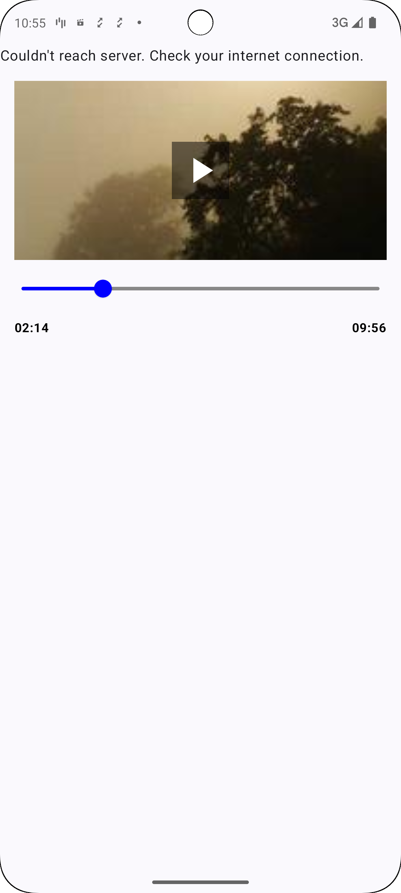
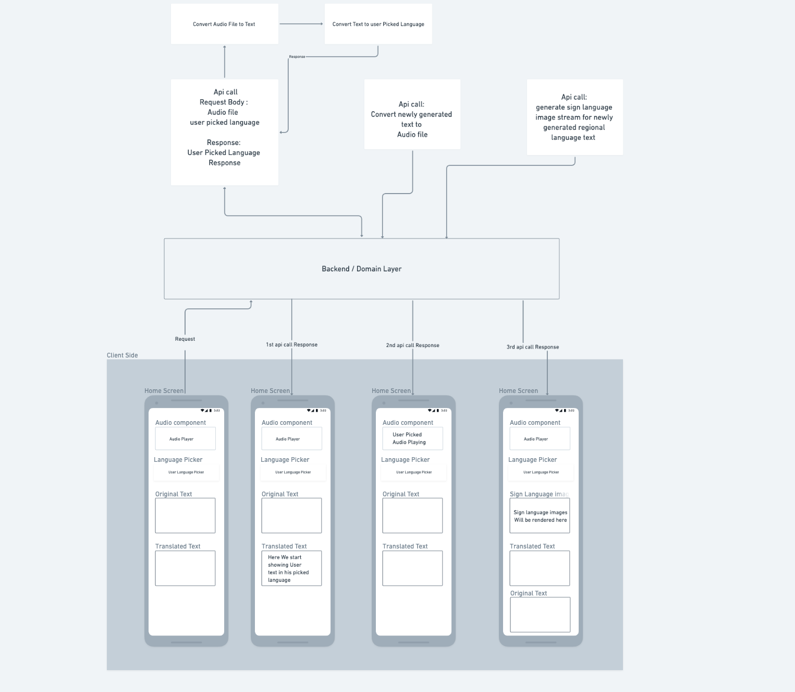

# Android App Code 

# AI-Powered Multilingual Commentary Platform

This project aims to revolutionize sports and event broadcasting by leveraging AI to provide automated, multilingual commentary. This enhances accessibility, affordability, and engagement for regional fans worldwide. The project is currently in the Proof of Concept (POC) stage, focusing on core functionalities and demonstrating the feasibility of the concept.

## Project Overview

The core idea behind this project is to use AI to generate real-time, multilingual commentary for live events. This is achieved by:

1.  **Text Conversion:** Converting English commentary text into multiple regional languages.
2.  **Text-to-Speech:** Generating audio commentary in the target languages with a native accent.
3.  **Speech-to-Text:** Converting audio commentary back to English text for analysis and further processing.
4. **Multi-Language Commentary:** Use AI to generate automated, multilingual commentary improving accessibility, affordability, and engagement for regional fans.

This project addresses the following key challenges in the broadcasting industry:

*   **Accessibility:** By providing commentary in multiple languages, we make events accessible to a much wider audience.
*   **Affordability:** Automated commentary reduces the need for expensive human commentators for each language.
*   **Engagement:** By offering commentary in their native language, fans can engage more deeply with the event.

## Core Components

The project's core components are:

*   **Text Conversion Tools:** AI-powered tools that translate English text into multiple regional languages.
*   **Text-to-Audio Conversion:** Tools that convert translated text into natural-sounding audio with native accents.
*   **Audio-to-Text Conversion:** Tools that convert audio commentary back into English text.
*   **Android App (POC UI):** A mobile application that serves as the frontend UI for the POC, demonstrating the core features.

## Cool Features

This project goes beyond simple translation and includes innovative features to enhance the user experience:

1.  **Sign Language Image Generation:**
    *   Generates sign language images from the available regional text, significantly improving accessibility for hearing-impaired individuals.
2.  **Social Media Integration:**
    *   Stitches relevant social media posts into the text transcript, providing a richer and more engaging experience.
    *   (Future) Explore converting social media content to audio for a more immersive experience.
3.  **Low-Bandwidth Optimization:**
    *   For devices with limited bandwidth, the app can directly expose the generated regional text.
    *   Leverages device-specific speech-to-text capabilities for a premium experience on low-bandwidth devices.

## Features

*   **Multilingual Text Translation:** Converts English text to multiple regional languages.
*   **Text-to-Speech Conversion:** Generates audio commentary in the target languages.
*   **Speech-to-Text Conversion:** Converts audio commentary back to English text.
*   **Sign Language Image Generation:** Creates sign language images from regional text.
*   **Social Media Integration:** Embeds social media posts into the text transcript.
*   **Low-Bandwidth Mode:** Optimizes for low-bandwidth devices by exposing regional text and using device-specific speech-to-text.
*   **Audio Playback:** Plays audio from a URL using the Media3 library.
*   **Play/Pause Control:** Allows users to start and pause audio playback.
*   **Buffering Indicator:** Displays a circular progress indicator while the audio is buffering.
*   **Seekbar:** Provides a seekbar to allow users to jump to different positions in the audio.
*   **Dependency Injection:** Uses Hilt for dependency injection, making the code more modular and testable.
*   **Image Loading:** Uses Coil for efficient and easy image loading.
*   **Error Handling:** Includes basic error handling for image loading.
* **Recomposition optimization:** The project uses `key` and `derivedStateOf` to avoid unnecessary recompositions.

## Tech Stack

*   **Kotlin:** The primary programming language.
*   **Jetpack Compose:** The modern UI toolkit for building native Android UIs.
*   **Media3:** The library for media playback on Android.
*   **Hilt:** The dependency injection library for Android.
*   **Coil:** The image loading library for Android.
*   **Coroutines:** For asynchronous programming.
*   **Flow:** For handling data streams.
*   **AI/ML Tools:** (Specific tools to be determined) for text translation, text-to-speech, and sign language image generation.
* **Android SDK:** For building the Android App.

## Screenshots

Here are some screenshots of the application in action:

### FLOW DIAGRAM

## Contributing

Contributions are welcome! If you'd like to contribute to this project, please follow these steps:

1.  Fork the repository.
2.  Create a new branch for your feature or bug fix.
3.  Make your changes and commit them.
4.  Push your changes to your forked repository.
5.  Submit a pull request.

## Future Enhancements

*   **Advanced AI Integration:** Improve the quality and accuracy of text translation, text-to-speech, and sign language image generation.
*   **Real-time Commentary:** Implement real-time processing for live events.
*   **More Languages:** Add support for more regional languages.
*   **Customizable UI:** Allow users to customize the appearance of the app.
*   **User Profiles:** Implement user profiles to save language preferences and other settings.
*   **More Robust Error Handling:** Improve error handling for network issues, AI/ML tool failures, etc.
*   **Download Support:** Add the ability to download audio for offline playback.
* **More tests:** Add more unit and UI tests.

## License

This project is licensed under the [MIT License](LICENSE).

## Contact

If you have any questions or suggestions, feel free to contact me at [contact@gouthamreddy.com](mailto:contact@gouthamreddy.com).
